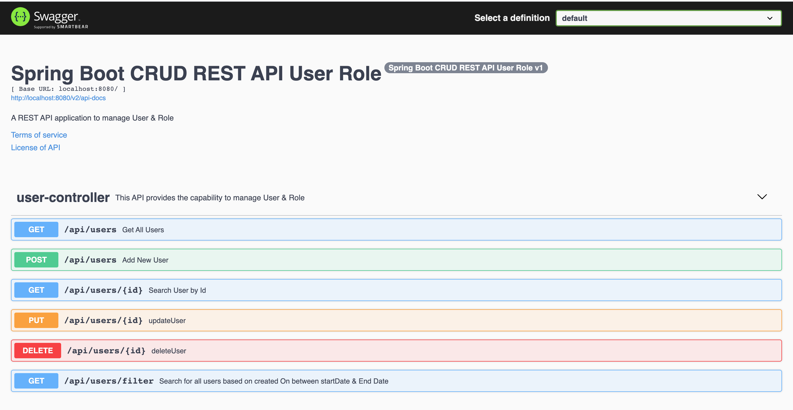

# Spring Boot CRUD REST API - User & Role Management

A production-ready RESTful API built with Spring Boot 3.5.7 for managing users and roles with comprehensive CRUD
operations, pagination, filtering, and interactive API documentation.

## Tech Stack

- **Java 21** - Latest LTS version
- **Spring Boot 3.5.7** - Latest Spring Boot framework
- **Spring Data JPA** - Data access layer with Hibernate
- **MySQL 8** - Relational database
- **SpringDoc OpenAPI 2.7.0** - API documentation (Swagger UI)
- **Lombok** - Reducing boilerplate code
- **Maven** - Dependency management and build tool

## Features

- Full CRUD operations for User management
- User-Role association (Many-to-Many relationship)
- Pagination and sorting support
- Date-based filtering
- JPA Auditing for automatic timestamp tracking
- Input validation with Bean Validation
- Interactive API documentation with Swagger UI
- Auto-create database schema with Hibernate DDL

## Prerequisites

- Java 21 or higher
- MySQL 8.0 or higher
- Maven 3.6 or higher

## Getting Started

### 1. Clone the repository

```bash
git clone https://github.com/hendisantika/springboot-crud-rest-api-user-role.git
cd springboot-crud-rest-api-user-role
```

### 2. Configure MySQL Database

Update the MySQL credentials in `src/main/resources/application.properties`:

```properties
spring.datasource.url=jdbc:mysql://localhost:3306/users?createDatabaseIfNotExist=true
spring.datasource.username=root
spring.datasource.password=root
```

The database `users` will be created automatically if it doesn't exist.

### 3. Initialize Roles (Required)

Before using the API, you need to insert the default roles into the database. Start MySQL and run:

```sql
INSERT INTO roles (id, name)
VALUES (1, 'SUPER ADMIN'),
       (2, 'ADMIN'),
       (3, 'EDITOR'),
       (4, 'USER');
```

Alternatively, you can enable the `InitRoles` component in
`src/main/java/com/hendisantika/userrole/config/InitRoles.java` by uncommenting the `@Component` annotation.

### 4. Build the application

```bash
mvn clean package
```

### 5. Run the application

```bash
mvn spring-boot:run
```

Or run the JAR file:

```bash
java -jar target/user-role-0.0.1-SNAPSHOT.jar
```

The application will start on `http://localhost:8080`

## API Documentation

### Swagger UI (Interactive)

Once the application is running, access the Swagger UI at:

```
http://localhost:8080/swagger-ui/index.html
```

### OpenAPI JSON

The OpenAPI 3.0 specification is available at:

```
http://localhost:8080/v3/api-docs
```

## API Endpoints

### User Management

| Method | Endpoint            | Description                                 |
|--------|---------------------|---------------------------------------------|
| POST   | `/api/users`        | Create a new user (auto-assigned USER role) |
| GET    | `/api/users`        | Get all users (with pagination)             |
| GET    | `/api/users/{id}`   | Get user by ID                              |
| PUT    | `/api/users/{id}`   | Update user details                         |
| DELETE | `/api/users/{id}`   | Delete user                                 |
| GET    | `/api/users/filter` | Filter users by creation date range         |

### Example Requests

#### Create a User

```bash
curl -X POST http://localhost:8080/api/users \
  -H "Content-Type: application/json" \
  -d '{
    "username": "john_doe",
    "email": "john@example.com",
    "fullName": "John Doe"
  }'
```

#### Get All Users (with pagination)

```bash
curl "http://localhost:8080/api/users?page=0&size=10&sort=createdOn,desc"
```

#### Filter Users by Date

```bash
curl "http://localhost:8080/api/users/filter?startDate=2025-01-01%2000:00&endDate=2025-12-31%2023:59"
```

## Database Schema

### Users Table

| Column     | Type         | Constraints                 |
|------------|--------------|-----------------------------|
| id         | BIGINT       | PRIMARY KEY, AUTO_INCREMENT |
| username   | VARCHAR(20)  | NOT NULL                    |
| email      | VARCHAR(45)  | NOT NULL, UNIQUE            |
| full_name  | VARCHAR(100) | NOT NULL                    |
| created_on | DATETIME     | AUTO-POPULATED              |

### Roles Table

| Column | Type        | Constraints                 |
|--------|-------------|-----------------------------|
| id     | INTEGER     | PRIMARY KEY, AUTO_INCREMENT |
| name   | VARCHAR(45) | NOT NULL                    |

### Users_Roles Table (Join Table)

| Column  | Type    | Constraints             |
|---------|---------|-------------------------|
| user_id | BIGINT  | FOREIGN KEY → users(id) |
| role_id | INTEGER | FOREIGN KEY → roles(id) |

## Migration to Spring Boot 3.x

This project has been migrated from Spring Boot 2.x to 3.5.7. Key changes include:

- **Jakarta EE Migration**: All `javax.*` packages have been replaced with `jakarta.*`
    - `javax.persistence.*` → `jakarta.persistence.*`
    - `javax.validation.*` → `jakarta.validation.*`
    - `javax.annotation.*` → `jakarta.annotation.*`

- **Swagger/OpenAPI**: Migrated from Springfox to SpringDoc OpenAPI
    - Old URL: `http://localhost:8080/swagger-ui/index.html`
    - New URL: Same, but using OpenAPI 3.0 specification
    - Annotations changed from `@Api`, `@ApiOperation` to `@Tag`, `@Operation`

- **Repository Pattern**: Updated to use `JpaRepository` instead of `PagingAndSortingRepository` for full CRUD support

## Project Structure

```
src/main/java/com/hendisantika/userrole/
├── config/              # Configuration classes
│   ├── AuditConfiguration.java
│   ├── AuditorAwareImpl.java
│   ├── SwaggerConfig.java
│   └── InitRoles.java
├── controller/          # REST controllers
│   └── UserController.java
├── entity/              # JPA entities
│   ├── User.java
│   └── Role.java
├── exception/           # Custom exceptions
│   └── UserRegistrationException.java
├── repository/          # Spring Data repositories
│   ├── UserRepository.java
│   └── RoleRepository.java
├── service/             # Business logic
│   └── UserService.java
└── SpringbootCrudRestApiUserRoleApplication.java
```

## Development

### Running Tests

```bash
mvn test
```

### Building for Production

```bash
mvn clean package -DskipTests
```

## Troubleshooting

### MySQL Connection Issues

If you encounter connection issues:

1. Ensure MySQL is running: `mysql.server start` (macOS) or `sudo service mysql start` (Linux)
2. Verify credentials in `application.properties`
3. Check if port 3306 is accessible

### Port 8080 Already in Use

Change the port in `application.properties`:

```properties
server.port=8081
```

### Lombok Not Working

Ensure your IDE has Lombok plugin installed and annotation processing enabled.

## Contributing

1. Fork the repository
2. Create your feature branch (`git checkout -b feature/amazing-feature`)
3. Commit your changes (`git commit -m 'Add some amazing feature'`)
4. Push to the branch (`git push origin feature/amazing-feature`)
5. Open a Pull Request

## License

This project is open source and available under the MIT License.

## Author

**Hendi Santika**

- Email: hendisantika@gmail.com
- Telegram: @hendisantika34
- GitHub: [@hendisantika](https://github.com/hendisantika)

## Screenshot

### Swagger UI



## Changelog

### Version 0.0.1-SNAPSHOT

- Migrated to Spring Boot 3.5.7
- Upgraded to Java 21
- Migrated from Springfox to SpringDoc OpenAPI
- Updated all Jakarta EE namespaces
- Enhanced API documentation
- Improved error handling
- Added comprehensive README
